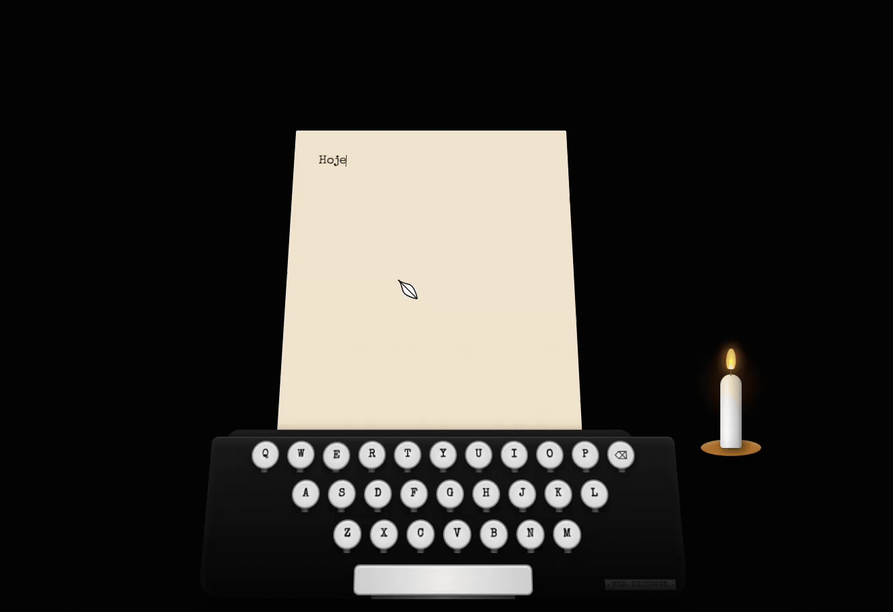
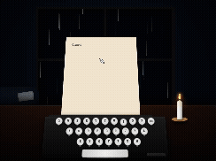

# 🕯️ Catarse - O Bloco de Notas Terapêutico

Um espaço digital minimalista e seguro para a prática da **Escrita Expressiva**, projetado para o alívio cognitivo através da destruição simbólica de pensamentos.

### 🌐 Acesse a aplicação ao vivo: [Link do Projeto](https://letitburn.netlify.app/)

  
  

---

## 📌 Sobre o Projeto

O **Catarse** é uma aplicação web *client-side* (PWA) que funciona como um "bloco de notas terapêutico". Ele oferece uma interface imersiva, livre de distrações e com áudio ambiente (chuva e sons reais de máquina de escrever) onde o usuário pode externalizar pensamentos intrusivos, estresse ou angústias emocionais. 

O grande diferencial do projeto não é salvar informações, mas sim **destruí-las**. Ao finalizar a escrita, o usuário aciona a queima da folha, que gera uma animação imersiva de fogo, consumindo o texto na tela ao som de chamas e, simultaneamente, apagando o dado de forma permanente da memória do navegador.

## 🧠 A Base Psicanalítica

A arquitetura e a experiência de usuário deste projeto foram desenhadas com base em conceitos sólidos da psicanálise e da psicologia comportamental:

*   **Abreação (Sigmund Freud):** A liberação de emoções reprimidas ligadas a memórias ou pensamentos angustiantes. Externalizar o pensamento em palavras reduz a carga mental exigida pelo mecanismo de "recalque".
*   **A Destruição Simbólica (D. W. Winnicott):** Para amadurecer emoções e lidar com o mundo interno, o ser humano necessita, por vezes, destruir o objeto na fantasia. O site atua como um espaço seguro onde o pensamento (o objeto) é materializado e ativamente destruído pelo usuário, promovendo o encerramento de um ciclo emocional.
*   **Escrita Expressiva (James Pennebaker):** A técnica comprovada de que escrever livremente sobre emoções por 15 a 20 minutos reestrutura os caminhos cognitivos, diminuindo a ansiedade crônica.

## 🔒 Arquitetura e Privacidade (Zero Persistência)

A premissa fundamental desta ferramenta é a segurança psicológica do usuário, o que exige um rigor arquitetônico específico: **o dado não pode persistir**.

*   **Sem Banco de Dados:** A aplicação não possui comunicação com back-ends de armazenamento estruturado (SQL/NoSQL).
*   **Memory-Only:** O texto digitado existe exclusivamente no estado local (State) da aplicação React, rodando apenas no dispositivo do usuário.
*   **Destruição Sincronizada:** No milissegundo em que a animação visual de encerramento (o fogo) termina, o estado que armazena a string de texto é sobrescrito e apagado da memória RAM, impossibilitando qualquer recuperação.
*   **PWA Offline:** A aplicação funciona sem necessidade de internet através de Service Workers, garantindo máxima privacidade em modo avião.

## 🛠️ Tecnologias e UX Engineering

A aplicação foi construída com foco absoluto em Imersão e Alta Performance no Front-end:

*   **React (Vite):** Para a construção da interface reativa e controle estrito do ciclo de vida dos dados e áudios na memória.
*   **CSS3 Avançado (3D & Keyframes):** Animações nativas complexas para simular a perspectiva isométrica da máquina, a gravidade, a queima do papel (`mix-blend-mode` e `mask-image`) e o flicker da vela.
*   **Engine de Áudio Reativa:** Sons independentes e perfeitamente sincronizados para o "tec" do teclado, a alavanca da máquina, chuva ambiente e fogueira dinâmica.
*   **Haptic Feedback (Vibration API):** Resposta tátil celular sincronizada com as teclas e com a queima do papel, conectando fisicamente o usuário à experiência digital.

---
Desenvolvido por **Deivesson (Deivcode)**. 
Conecte-se comigo no [LinkedIn](https://linkedin.com/in/deivesson-ferreira) | [GitHub](https://github.com/deivcode)
